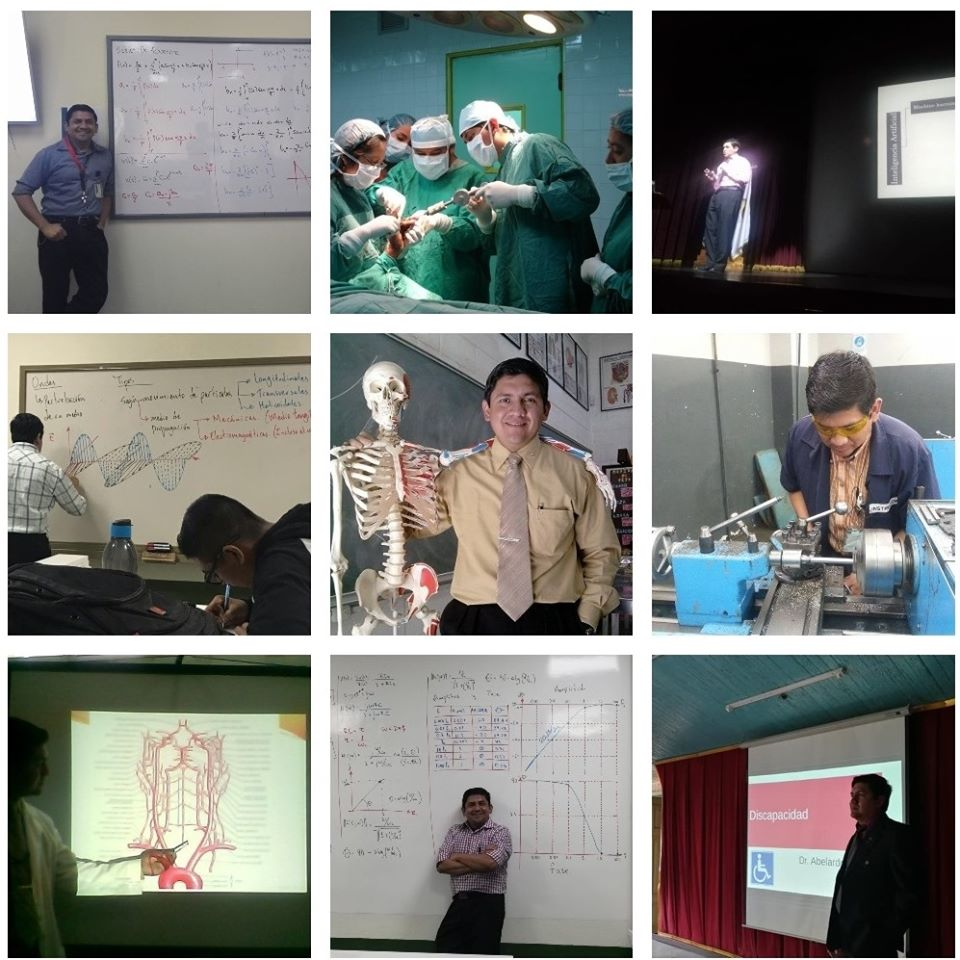

```{r setup, include=FALSE}
options(htmltools.dir.version = FALSE)
```

name: title-slide
class: inverse, left, middle
background-image: url(`r params$background_img`)
background-size: cover

## .fancy[Taller de gráficas estadísticas con R]

### .large[Abelardo Méndez]
### .large[Rstudio | 14 de agosto, 2020]

---
# Importar datos desde GoogleSheets
Para importar datos desde una hoja de cálculo de Google debe contar con permiso de edición o autenticarse como usuario desde R (sólo se describirá el proceso de autenticación por seguridad).  

También es necesario instalar los paquetes **dplyr** y **googlesheets** si aún no cuenta con ellos
```{r comment='#', eval=FALSE}
# El tiempo de instalación dependerá de las necesidades de actualización
# de otros repositorios
install.packages("googlesheets")
install.packages("dplyr")
# «Se ha omitido los mensajes de instalación»
```
Cargar ambos paquetes
```{r comment='#', message=FALSE}
library(dplyr)
library(googlesheets)
```
---
# Importar datos desde GoogleSheets
Se carga el libro (vinculado a una variable)
```{r comment='#', message=FALSE, warning=FALSE}
# La variable que se utiliza para este caso es "libro"
libro <- gs_url("https://docs.google.com/spreadsheets/d/1qPWSXiWmISxjD47A8yENzkr4cahBo5nrlsXPbBOrC_E/edit?usp=sharing")
# Sheet-identifying info appears to be a browser URL.
# googlesheets will attempt to extract sheet key from the URL.
# Putative key: «se ha omitido intencionalmente el valor de la clave»
# Worksheets feed constructed with public visibility
# Warning: `as_data_frame()` is deprecated as of tibble 2.0.0.
# Please use `as_tibble()` instead.
# The signature and semantics have changed, see `?as_tibble`.
# This warning is displayed once every 8 hours.
# Call `lifecycle::last_warnings()` to see where this warning was generated.
```
---
# Importar datos desde GoogleSheets
Puesto que los datos están contenidos en una hoja del libro, la cargaremos a una variable para generar la tabla a analizar.

```{r comment='#', }
# La variable que se utiliza para este caso es "libro"
datos <- gs_read_csv(libro, ws=1)
```
---
# Imporar datos desde GoogleSheets
```{r comment='#', }
# Veamos las primeras 10 filas
datos[1:10,]
```
1. Dos variables cualitativas: Área y Rol
1. Una variable cuantitativa: Conocimiento
---
# Gráfico de barras
```{r comment='#', fig.align="center", fig.width=11, fig.height=6}
# Para ello se utiliza la función barplot
# La sintaxis básica es barplot(conjunto_de_datos, main="Título principal")
barplot(table(datos$Area),main="Área a la que pertenece")
```
---
# Gráfico de barras
```{r comment='#', fig.align="center", fig.width=11, fig.height=6 }
# También puede realizarse con las frecuencias relativas
# Puede facilitar su trabajo si emplea variables para generar las tablas
barplot(prop.table(table(datos$Area)),main="Área a la que pertenece")
```
---
# Gráfico de barras
```{r comment='#', fig.align="center", fig.width=11, fig.height=6}
# Ahora la gráfica para rol y además se coloca los títulos de los ejes
# xlab ="Título del eje x", ylab="Título del eje Y"
barplot(table(datos$Rol),main="Rol que desempeña",xlab="Rol", ylab = "Asistentes")
```
---
# Generación de un banco de datos
Para ello se hará uso de números aleatorios y los resultados se almacenarán en variables para utilizarlas en los próximos ejemplos.  
```{r comment='#'}
# función set.seed(secuencia) inicia el generador de números aleatorios
# el valor de la secuencia es arbitrario pero debe ser entero
set.seed(1)
# función rnorm(n, mean= valor_media, sd=valor_desviación)
pesoH <- rnorm(50, mean=150, sd=8)
pesoM <- rnorm(50, mean=120, sd=3)
pesoH
```
---
# Histograma
```{r comment='#', fig.align="center", fig.width=11, fig.height=5}
# función hist(variable, breaks=vector_intervalos, freq=valor_lógico), el asignar TRUE para
# valor_lógico indica que el histograma es una representación de frecuencias y FALSE plotea
# los componentes de densidad de probabilidad
hist(pesoH, breaks = 5, freq = TRUE)
```
---
# Histograma
```{r comment='#', fig.align="center", fig.width=11, fig.height=6}
# también puede elegirse breaks siguiendo la regla de Sturges
hist(pesoH, breaks = "Sturges", freq = TRUE, main = "Distribución de Peso(lb)")
```
---
# Histograma
```{r comment='#', fig.align="center", fig.width=11, fig.height=6}
# Observe el eje Y, ahora se utilizó freq como densidad de probabilidad
hist(pesoH, breaks = 5, freq = FALSE, main = "Distribución de Peso(lb)")
```
---
# Histograma
Ahora combinemos dos grupos, aplicaremos color a cada uno para distinguirlos. Para evitar saturación acá se dejan las instrucciones y en el siguiente slide se agrega la gráfica.  
```{r comment='#', eval=FALSE}
# La primera se genera con los datos de peso en hombres -> pesoH
hist(pesoH, breaks = 5, xlim=c(110,175), main = "Distribución de Peso(lb)", 
     xlab = "Peso", ylab= "Frecuencia", col=rgb(0,0,1,0.5))
```
Note que el parámetro xlim corresponde a los límites inferior y superior para el eje X # se recomienda que previo a generar el gráfico verifique los valores máximo y mínimo de cada conjunto de datos para seleccionar el rango adecuado.
```{r comment='#', eval=FALSE}
# Se genera el segundo histograma con los datos de peso en mujeres -> pesoM
# y se agrega el parámetro add=TRUE, para que lo dibuje por encima
hist(pesoM, breaks = 5, xlim=c(110,175), col=rgb(1,0,0,0.5), add=TRUE)
# Agregamos una leyenda
legend("topright", legend=c("Hombres","Mujeres"), col=c(rgb(0,0,1,0.5),
    rgb(1,0,0,0.5)), pt.cex=2, pch=15 )
```
---
# Histograma
```{r comment='#', echo=FALSE, fig.align="center", fig.width=12, fig.height=6.5}
hist(pesoH, breaks = 5, xlim=c(110,175), main = "Distribución de Peso(lb)",
     xlab = "Peso", ylab= "Frecuencia", col=rgb(0,0,1,0.5))
hist(pesoM, breaks = 5, xlim=c(110,175), col=rgb(1,0,0,0.5), add=TRUE)
legend("topright", legend=c("Hombres","Mujeres"), col=c(rgb(0,0,1,0.5),
    rgb(1,0,0,0.5)), pt.cex=2, pch=15 )

```
---
# Histograma
También se puede generar una matriz de gráficos, acá se colocan las instrucciones en el siguiente slide se muestra el resultado.
```{r comment='#', eval=FALSE, fig.width=10, fig.height=4}
# Función par(), parámetros mfrow=c(nfilas,mcolumnas), mar(abajo, izquierda, arriba, derecha)
par(
  mfrow=c(1,2),
  mar=c(4,4,1,0)
)
# Primer histograma, quedará a la izquierda
hist(pesoH, breaks = 5, main = "", xlab = "Peso", ylab= "Frecuencia", col=rgb(0,0,1,0.5))
# Se genera el segundo histograma
hist(pesoM, breaks = 5, main = "", xlab = "Peso", ylab="", col=rgb(1,0,0,0.5), add=TRUE)
# Se agrega un título común para la matriz de gráficos con la función mtext
mtext("Distribución de peso en Hombres y Mujeres", side=3, outer=TRUE, line=-1)
```
---
# Histograma
```{r comment='#', echo=FALSE, fig.align="center", fig.width=12, fig.height=6.5}
par(
  mfrow=c(1,2),
  mar=c(4,4,1,0)
)
hist(pesoH, breaks = 5, main = "", xlab = "Peso", ylab= "Frecuencia", col=rgb(0,0,1,0.5))
hist(pesoM, breaks = 5, main = "", xlab = "Peso", ylab="", col=rgb(1,0,0,0.5))
mtext("Distribución de peso en Hombres y Mujeres", side=3, outer=TRUE, line=-1)
```
---
# Box Plot
```{r comment='#', fig.align="center", fig.width=8, fig.height=5}
# Se debe crear una tabla de datos con los nombres y valores
# Se procede a crear el vector de valores para los nombres
series <- c("Hombres", "Mujeres")
valores <- c(pesoH,pesoM)
conjunto <- data.frame(series, valores)
boxplot(conjunto$valores ~ conjunto$series, ylab = "Peso", xlab = "Grupo")
```
---
# Gráfica de sectores
Para este gráfico se utilizará ggplot2 y se alimentará con los datos almacenados en la variable valores
```{r comment='#', eval=FALSE}
# Se hace llamada a ggplot2
library(ggplot2)
# Se crea la serie de datos con los valores y etiquetas de cada categoría
datosC <- data.frame(grupo=c("Primero","Segundo","Tercero","Cuarto","Quinto"),
                     valores=c(13,7,9,21,2))
# Gráfico de sectores básico
ggplot(datosC, aes(x="", y=valores, fill=grupo)) + geom_bar(stat="identity", width=1) +
  coord_polar("y", start=0)
```
Los parámetros de ggplot corresponden al conjunto de valores en datosC y tanto las etiquetas de los ejes como los valores para generarlo en el parámetro aes.
---
# Gráfica de sectores
```{r comment='#', echo=FALSE, fig.align="center", fig.width=9, fig.height=7}
# Para este gráfico se utilizará ggplot2 y se genera un banco de datos
library(ggplot2)
datosC <- data.frame(grupo=c("Primero","Segundo","Tercero","Cuarto","Quinto"),
                     valores=c(13,7,9,21,2))
# Gráfico de sectores básico
ggplot(datosC, aes(x="", y=valores, fill=grupo)) + geom_bar(stat="identity", width=1) +
  coord_polar("y", start=0)
```
---
class: inverse, middle, center
background-image: url(https://upload.wikimedia.org/wikipedia/commons/3/39/Naruto_Shiki_Fujin.svg)
background-size: contain

# ¿Dudas?

---
class: middle

# Gracias por su atención
.pull-left[  
Contacto y redes sociales (algunas)  
`r icon::fa_envelope()` [abemen@mesoamericana.edu.gt](mailto:abemen\@mesoamericana.edu.gt)  
`r icon::fa_telegram()` [abemen](https://t.me/abemen)  
`r icon::fa_r_project()` [abemen](https://rpubs.com/abemen)  
`r icon::fa_github()` [abemen](https://github.com/abemen)  
`r icon::fa_slideshare()` [abemen](https://www.slideshare.net/abemen)  
`r icon::fa_twitch()` [abemen](https://www.twitch.tv/abemen)  
`r icon::fa_facebook_square()` [abemenAcademico](https://www.facebook.com/abemenAcademico/)  
`r icon::fa_youtube()`[Abelardo Méndez](https://www.youtube.com/channel/UCLYnnL5sh8URlm4y_PlTOIw/)  
`r icon::fa_blogger()` [https://abemen-academico.blogspot.com/](https://abemen-academico.blogspot.com/)]
.pull-right[

]