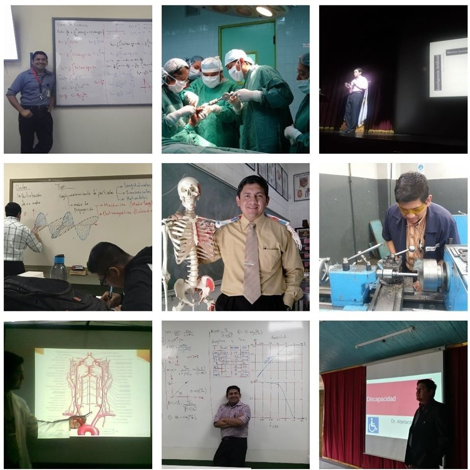

```{r setup, include=FALSE}
options(htmltools.dir.version = FALSE)
```

name: title-slide
class: inverse, left, middle
background-image: url(`r params$background_img`)
background-size: cover

## .fancy[Taller de estadística con R]

### .large[Abelardo Méndez | Rstudio | `r format(Sys.time(), '%d %B, %Y')`]

---
# R Studio
.pull-left[

]

.pull-right[
Es un entorno de desarrollo integrado para el lenguaje de programación R.  
1. Área de código
1. Consola
1. Espacio de trabajo | Historial
1. Archivos | Gráficas | Paquetes | Ayuda
]
---
# R
.pull-left[
1. Es un lenguaje de programación.
1. Las variables no necesitan una declaración de tipo.
1. Los índices de vectores y listas inicia en 1.
1. Las listas reunen variedad de objetos bajo el mismo nombre.
1. La forma más básica de usar R es el modo interactivo (resultado inmediato al escribir comandos)
]
.pull-right[
Por ejemplo:  
```{r comment='#'}
# Usando R como una calculadora
3*4+5/2
```
Asignación de datos a una variable:  
```{r comment='#'}
# Asignación de valores
a <- 5
b <- "Hola"
# Para usar una variable basta con
# escribirla en la consola ej:
a
```
]

---
# R - vectores
Creación de un vector:
```{r comment='#'}
# Vector con los valores 2, 4, 5, 8, 3
c(2,4,5,8,3) 
```
Generación de una secuencia:  
```{r comment='#'}
# Rango de valores desde 2 hasta 8
2:8
```
Generación de una secuencia especificando el paso:  
```{r comment='#'}
# Valores 2 hasta 3 con cambios de 0.1
seq(2, 3, by=0.1)
```
---
# R - vectores
Vector repetitivo:  
```{r comment='#'}
# Valores 1 hasta 3 repetido 4 veces
rep(1:3, times = 4)
```
Vector con elementos repetidos n veces
```{r comment='#'}
# Valores 1 al 3 cada uno repetido 4 veces
rep(1:3, each=4)
```
---
# R - vectores
También se pueden asignar los vectores a las variables
```{r comment='#'}
# x = secuencia de valores desde 1 hasta 5 con un paso de 0.5
x <- seq(1, 5, by=0.5)
x
```
Hacer operaciones con esos vectores
```{r comment='#'}
# observe la operación realizada con el vector anterior ¿Qué hace?
x + 10
```

---
# R - vectores
Se pueden obtener datos de los vectores
```{r comment='#'}
# El valor almacenado en la posición 4
x [3]
```
Omitir datos
```{r comment='#'}
# Obtener el conjunto de valores excepto el de la posición 3
x[-3]
```
Elementos que cumplan una condición
```{r comment='#'}
# Obtener el conjunto de valores mayores a 3
x[x>3]
```

---
# R - matrices
.pull-left[
Tomaremos los valores del vector x para llenar la matriz
```{r comment='#'}
# El vector x posee 9 elementos, podemos
# crear una matriz de 3x3 por ejemplo
m <- matrix(x, nrow=3, ncol=3)
m
```
]
.pull-right[
El número total de elementos de la matriz debe coincidir con el número de elementos del vector o bien ser un múltiplo de este
```{r comment='#'}
# El vector x posee 9 elementos, podemos
# crear una matriz de 3x6 por ejemplo
m <- matrix(x, nrow=3, ncol=6)
m
```
]
---
# R - data frame
Es un caso especial de lista en la que todos los elementos son de la misma longitud
.pull-left[
```{r comment='#'}
# Construyamos una tabla de 3x2
# La primera columna contiene 1,2 y 3
# La segunda columna contiene a,b y c
df <- data.frame(una = 1:3, dos = c('a', 'b', 'c'))
df
```
]
.pull-right[
```{r comment='#'}
# Construyamos una tabla con el vector x
# dicho vector tiene 9 valores
# crearemos el vector y también con 9 valores
y = 1:9
df <- data.frame(x, y)
df
```
]
---
# R - gráficas
.pull-left[
Con el conjunto generado a partir de X y Y podemos trazar una gráfica con la función plot().  
  
La sintaxis de la función es simple plot(variableX, variableY) o bien el dataframe.
```{r comment='#'}
# Veamos los valores X y Y
x
y
```

]
.pull-right[
```{r comment='#'}
plot(df)
```
]
---
# R - cargar datos desde el portapapeles
Si tiene sus datos en una hoja de cálculo, una forma sencilla de utilizarlos es copiando y pegando. para ello puede utilizar una de las dos funciones siguientes:
```{r comment='#', eval=FALSE}
# Función para copiar y pegar datos de hoja de cálculo
datos <- read.table(file="clipboard")
```
o bien
```{r comment='#', eval=FALSE}
datos <- read.delim("clipboard")
```
---
# R - estadística descriptiva
Para este ejemplo tomarémos los datos de la hoja de cálculo que se comparte vía GoogleDrive [taller](https://docs.google.com/spreadsheets/d/1qPWSXiWmISxjD47A8yENzkr4cahBo5nrlsXPbBOrC_E/edit?usp=sharing). Copie y pegue los datos a la variable **datos**.  

```{r comment='#', echo=FALSE}
Area <-c("Humanidades","Ingenieria en sistemas","Ingeniería en electrónica","Ingenieria en telecomunicaciones","Ingenieria en sistemas","Ingenieria en sistemas","Ingenieria en telecomunicaciones","Ingeniería en electrónica","Ingenieria en sistemas","Ingenieria en sistemas","Ingenieria en sistemas","Ingenieria en telecomunicaciones","Ingenieria en sistemas","Ingenieria en telecomunicaciones","Ingenieria en telecomunicaciones","Ingenieria en sistemas","Ingenieria en sistemas")
Conocimiento <- c(10,6,8,5,5,7,8,5,5,7,4,7,9,6,3,7,5)
Rol <- c("Estudiante","Cargo administrativo","Estudiante","Estudiante","Estudiante","Exalumno profesional","Exalumno profesional","Estudiante","Docente de estadística","Desarrollador","Estudiante","Exalumno profesional","Estudiante","Desarrollador","Docente de estadística","Estudiante","Estudiante")
datos <- data.frame(Area,Conocimiento,Rol)
```
Las funciones a tratar a continuación hacen uso del conjunto de datos que a copiado desde el archivo.
```{r comment='#'}
# Veamos las primeras 7 filas
datos[1:7,]
```
---
# R - estadística descriptiva
Para estos ejemplos se utiliza como conjunto de datos la columna Conocimiento.
.pull-left[
### Tamaño de la distribución
```{r comment='#'}
length(datos$Conocimiento)
```
### Rango
```{r comment='#'}
range(datos$Conocimiento)
```
]
.pull-right[
### Máximo
```{r comment='#'}
max(datos$Conocimiento)
```
### Mínimo
```{r comment='#'}
min(datos$Conocimiento)
```
]
---
# R - estadística descriptiva
.pull-left[
### Media
```{r comment='#'}
mean(datos$Conocimiento)
```
### Mediana
```{r comment='#'}
median(datos$Conocimiento)
```
]
.pull-right[
### Desviación típica
```{r comment='#'}
sd(datos$Conocimiento)
```
### Varianza
```{r comment='#'}
var(datos$Conocimiento)
```
]
---
# R - estadística descriptiva
Los cuantiles se utilizan para obtener las medidas de posición y corresponden al percentil, valor entre [0 y 1].
.pull-left[
### Percentil
```{r comment='#'}
# Percentil 40
quantile(datos$Conocimiento,0.4)
```
### Decil
```{r comment='#'}
# Decil 8
quantile(datos$Conocimiento,0.8)
```
]
.pull-right[
### Cuartil
```{r comment='#'}
# Cuartil 3
quantile(datos$Conocimiento,0.75)
```
### Quintil
```{r comment='#'}
# Quintil 2
quantile(datos$Conocimiento,0.2)
```
]
---
# R - estadística descriptiva
Una tabla de resumen de estadísticos
```{r comment='#'}
# Resumen sobre datos cuantitativos
summary(datos$Conocimiento)
```
¿Y para las cualitativas?
```{r comment='#'}
# Para la columna Rol, el resumen devuelve lo siguiente
summary(datos$Rol)
```
---
# R - estadística descriptiva
También puede construirse una tabla de contingencia
```{r comment='#'}
# Almacenaremos la tabla de contingencia en la variable cTable y luego obtenemos el resumen
cTable <- table(datos$Rol)
cTable
summary(cTable)
```
---
# R - estadística descriptiva
Ahora utilicemos dos columnas para la tabla de contingencia
```{r comment='#'}
# Almacenaremos la tabla de contingencia en la variable cTable2 y luego obtenemos el resumen
cTable2 <- table(datos$Rol, datos$Conocimiento)
cTable2
summary(cTable2)
```
---
# R - más gráficos
### Histograma
```{r comment='#', fig.height=4, dev='svg'}
# Parámetros: main = título principal, xlab = título del eje x, ylab = título del eje y
hist(datos$Conocimiento, main = "Nivel de conocimiento", xlab = "Puntuación", ylab="Inscritos")
```
---
class: inverse, middle, center
# Un WidGet HTML interesante para despedirme
Siguiente Slide es interactivo, click sobre el globo azul...
---
```{r out.width='100%', fig.height=6, eval=require('leaflet')}
library(leaflet)
leaflet() %>% addTiles() %>% 
  setView(lng=-91.5418, lat=14.8437, zoom=16.5) %>% 
  addMarkers(lng=-91.5418, lat=14.8437, popup="Facultad de Ingeniería, Au! Au! Au!")
```
---
class: inverse, middle, center
background-image: url(https://upload.wikimedia.org/wikipedia/commons/3/39/Naruto_Shiki_Fujin.svg)
background-size: contain

# ¿Dudas?

---
class: middle

# Gracias por su atención
.pull-left[  
Contacto y redes sociales (algunas)  
`r icon::fa_envelope()` [abemen@mesoamericana.edu.gt](mailto:abemen\@mesoamericana.edu.gt)  
`r icon::fa_telegram()` [abemen](https://t.me/abemen)  
`r icon::fa_r_project()` [abemen](https://rpubs.com/abemen)  
`r icon::fa_github()` [abemen](https://github.com/abemen)  
`r icon::fa_slideshare()` [abemen](https://www.slideshare.net/abemen)  
`r icon::fa_twitch()` [abemen](https://www.twitch.tv/abemen)  
`r icon::fa_facebook_square()` [abemenAcademico](https://www.facebook.com/abemenAcademico/)  
`r icon::fa_youtube()`[Abelardo Méndez](https://www.youtube.com/channel/UCLYnnL5sh8URlm4y_PlTOIw/)  
`r icon::fa_blogger()` [https://abemen-academico.blogspot.com/](https://abemen-academico.blogspot.com/)]
.pull-right[

]